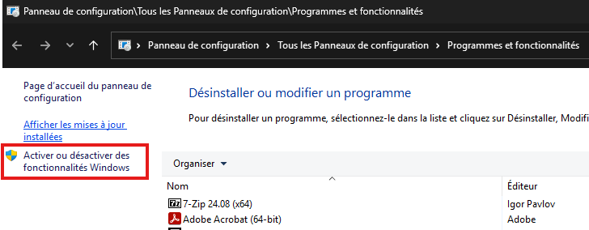
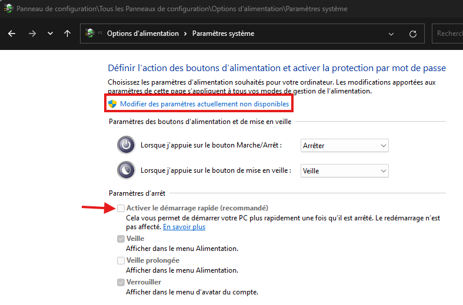

# Procédure de désactivation Hyper-V sur Windows

**Objectifs** : Désactiver totalement l'utilisation de l'Hyper-V dans **Windows 11 Pro**. Cette procédure fait suite aux problèmes de virtualisation apparu suite au déploiement du build **24h2**. Elle permet aussi d'activer la virtualisation imbriqué.
### Prérequis :
- **OS** : Windows 10 
- **Version** : Professionnel
- **Build** : 24h2
- **Virtualisation BIOS** : Activé

---
## Désactivation des fonctionnalités Windows

1. **Win**+**R** > `appwiz.cpl` > **Entrée**
2. Cliquer dans le bandeau de gauche **Activer ou désactiver des fonctionnalités Windows**.
	

3. Décocher toutes les cases suivant dans les **Fonctionnalités de Windows**:
	- Bac à sable Windows
	- Hyper-V
	- Plateforme de l'hyperviseur Windows 
	- Virtual Machine Platform
	
4. Les fonctionnalités se désinstallent et propose le redémarrage du poste. 
5. Redémarrer le poste.

	

---
## Désactivation de l'isolation du noyau

La désactivation de l'intégrité de la mémoire dans l'isolation du noyau permet d'utiliser la virtualisation imbriquée. Sans cela il est impossible de faire fonctionner une **VM GNS3**. 

1. Depuis le **menu démarrer**, rechercher **Isolation du noyau**.
2. Désactiver l'**Intégrité de la mémoire**. \
   
3. Redémarrer le poste.

---
## Conclusion
Une fois ces étapes effectuées, **Windows** ne devrait plus utiliser l'**Hyper-V**, ni bloquer la **virtualisation imbriqué**.

Afin de s'en assurer, lancez une VM depuis **VirtualBox**. 

Dans la barre d'information dans coin inférieur droit, vous devriez voir le logo suivant : 

---
## FAQ 

Si vous voyez encore apparaitre une icone de tortue verte avec un V sur le dos, c'est que **VirtualBox** utilise toujours l'**Hyper-V**. 
- Assurez-vous que toutes les fonctionnalités Windows aient bien été désactivé. 
- Vérifiez que vous êtes bien sur une version de Windows **Professionnel** et **24h2**.
- Voir si la virtualisation est bien activée dans le BIOS. 
- Vérifier que le **Démarrage Rapide** est bien **Désactivé** dans les **Options d'alimention** et redémarrer le poste une fois désactivé.
	
